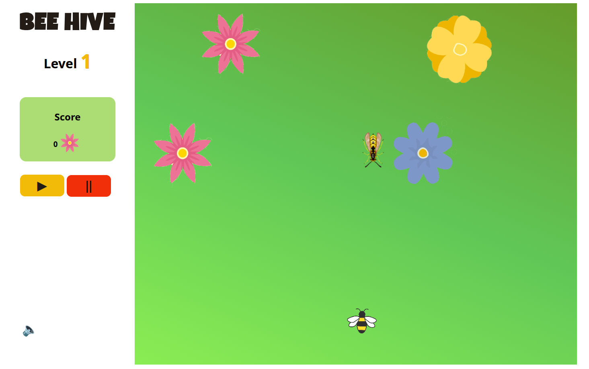

# 🐝 Bee Hive Game

**Bee Hive** is a simple and charming browser game where you help your buzzing friends gather pollen and avoid danger. The goal? Store enough pollen in the hive to survive the winter!



## 🎮 How to Play

1. Click the **▶ Start** button.
2. Move the bee to **collect pollen**
3. **Avoid the wasps** or you'll lose the level.
4. Gather enough pollen to progress to the next level.

## 💻 Project Structure

```bash
bee-hive/
├── index.html          # Main HTML structure
├── styles.css          # Game styles and layout
├── script.js           # Game logic and canvas rendering
├── /images             # Game assets (flowers, hive, bee, wasps, etc.)
└── README.md           # This file

```

## 📱 Responsive Design

The game canvas automatically resizes with the browser window, so it works well on both desktop and mobile screens.
